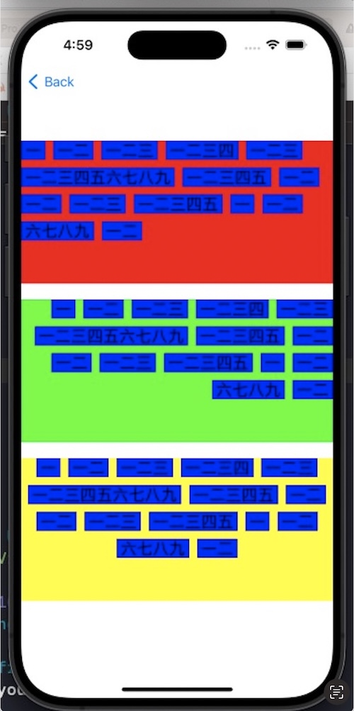

# XYZSpecialCollectionView

整理了工作中遇到的一些CollectionView布局或特殊滑动视图封装
均提供了Example

#### 1.```MiddleExpandCollectionView```中间放大的CollectionView


#### 2. ```TiltCollectionView```斜着滚动的CollectionView (基于ScrollView实现)


#### 3. ```AlignCollectionViewFollowLayout```collectionView的行对齐方式,左对齐 右对齐 居中

